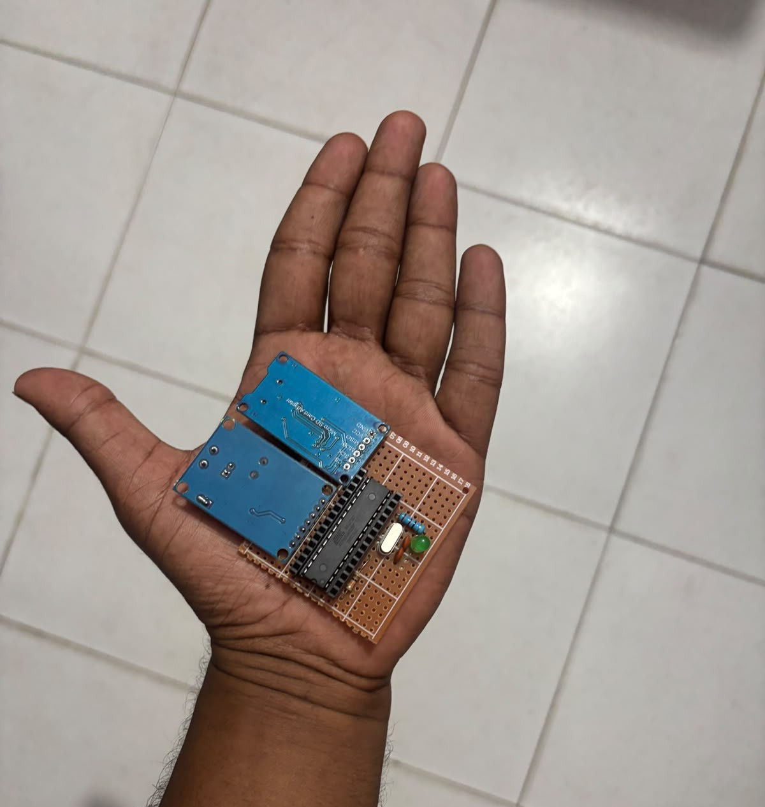
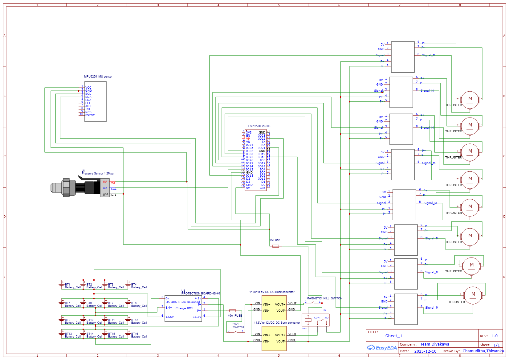
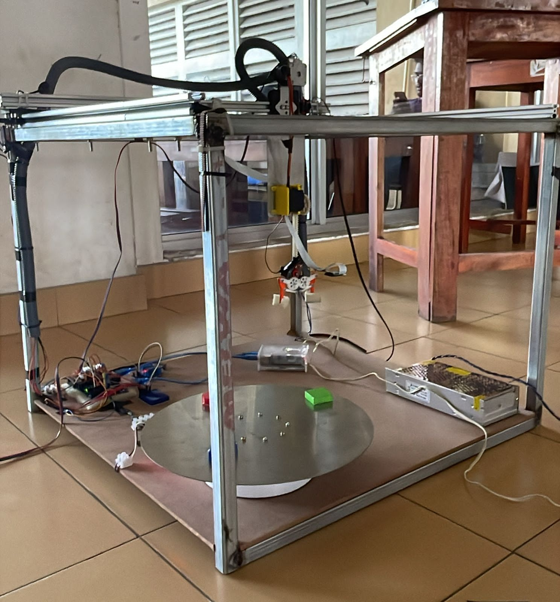
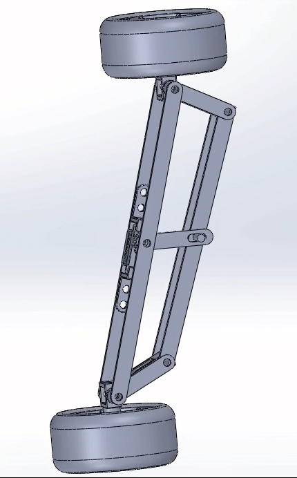

# Thiwanka Reiss

Engineering Undergraduate at the University of Moratuwa focused on embedded systems, robotics, and software engineering.

## Contact
- Email: thiwankar2003@gmail.com

## About Me

  

## Core Portfolio Projects
1. [CAN Logger (C++, Embedded, Automotive Communication)](https://github.com/ThiwankaReiss/Can_logger.git)
2. [Python Hand Gesture (Computer Vision, Python)](https://github.com/ThiwankaReiss/python-hand-gesture.git)
3. [Mechatronic Project (Embedded + Robotics Integration)](https://github.com/ThiwankaReiss/mechatronic-project.git)
4. [Fashion Shop Backend (Java, Spring Boot)](https://github.com/ThiwankaReiss/fashionShopBackend.git)
5. [AR Project Backend (Java, Spring Boot, MySQL)](https://github.com/ThiwankaReiss/AR-Project.git)
6. [AR Frontend (JavaScript)](https://github.com/ThiwankaReiss/AR-frontend.git)

## Project Highlights (With Visual Evidence)

### CAN Logger (SPI Hardware Build)
[CAN Logger Repository](https://github.com/ThiwankaReiss/Can_logger.git)

  

### Diyakawa Electrical Schematic
[Diyakawa Repository](https://github.com/ThiwankaReiss/Diyakawa.git)

  

### Thermistor Validation Setup
[Thermistor Validation Repository](https://github.com/ThiwankaReiss/Thermistor_Validation.git)

  

### Display UI
[DisplayCode Repository](https://github.com/ThiwankaReiss/DisplayCode.git)

  

### Mechatronic Pick-and-Place Robot
[Mechatronic Project Repository](https://github.com/ThiwankaReiss/mechatronic-project.git)

  

### SolidWorks Mechanical Design
[Steering Design ](https://github.com/ThiwankaReiss/Steering_mini_car_falcone.git)

  

## Skills to Project Mapping

### Programming Languages
- C++: [CAN Logger](https://github.com/ThiwankaReiss/Can_logger.git)
- Python: [Python Hand Gesture](https://github.com/ThiwankaReiss/python-hand-gesture.git), [Mechatronic Project](https://github.com/ThiwankaReiss/mechatronic-project.git)
- Java: [Fashion Shop Backend](https://github.com/ThiwankaReiss/fashionShopBackend.git), [AR Project](https://github.com/ThiwankaReiss/AR-Project.git)
- JavaScript: [AR Frontend](https://github.com/ThiwankaReiss/AR-frontend.git), [Weather App Electron](https://github.com/ThiwankaReiss/weather-app-electron.git), [Class Final](https://github.com/ThiwankaReiss/classfinal.git)
- MATLAB: [MATLAB Work](https://github.com/ThiwankaReiss/matlab-work.git)

### Embedded Systems
- CAN Bus: [DisplayCode](https://github.com/ThiwankaReiss/DisplayCode.git), [CAN Logger](https://github.com/ThiwankaReiss/Can_logger.git), [STM Work](https://github.com/ThiwankaReiss/STM-work.git)
- UART: [DisplayCode](https://github.com/ThiwankaReiss/DisplayCode.git)
- SPI: [CAN Logger](https://github.com/ThiwankaReiss/Can_logger.git)
- I2C: [Combined Logger](https://github.com/ThiwankaReiss/combined-logger.git)
- Arduino: [CAN Logger](https://github.com/ThiwankaReiss/Can_logger.git), [Mechatronic Project](https://github.com/ThiwankaReiss/mechatronic-project.git)
- Raspberry Pi: [Mechatronic Project](https://github.com/ThiwankaReiss/mechatronic-project.git), [DisplayCode](https://github.com/ThiwankaReiss/DisplayCode.git)
- STM32: [STM Work](https://github.com/ThiwankaReiss/STM-work.git)
- Data Acquisition (DAQ): [Thermistor Validation](https://github.com/ThiwankaReiss/Thermistor_Validation.git), [DisplayCode](https://github.com/ThiwankaReiss/DisplayCode.git), [CAN Logger](https://github.com/ThiwankaReiss/Can_logger.git)

### Robotics
- ROS: [ROS Udemy Course](https://github.com/ThiwankaReiss/ros-udemy-course.git)
- ROS2: [ROS2 Start](https://github.com/ThiwankaReiss/Ros2-start.git)
- Gazebo: [ROS Udemy Course](https://github.com/ThiwankaReiss/ros-udemy-course.git)
- Simulink: [MATLAB Work](https://github.com/ThiwankaReiss/matlab-work.git)
- Control Systems: [MATLAB Work](https://github.com/ThiwankaReiss/matlab-work.git)
- Proteus: [Thermistor Validation](https://github.com/ThiwankaReiss/Thermistor_Validation.git)
- EasyEDA: [Diyakawa](https://github.com/ThiwankaReiss/Diyakawa.git)

### CAD and Mechanical Design
- SolidWorks: [Mechatronic Project](https://github.com/ThiwankaReiss/Steering_mini_car_falcone.git)

### Software Development
- Spring Boot: [AR Project](https://github.com/ThiwankaReiss/AR-Project.git), [Fashion Shop Backend](https://github.com/ThiwankaReiss/fashionShopBackend.git)
- React: [Fashion Shop Frontend](https://github.com/ThiwankaReiss/fashionShopFrontend.git)
- Three.js: [Fashion Shop Frontend](https://github.com/ThiwankaReiss/fashionShopFrontend.git)
- Git: [Fashion Shop Frontend](https://github.com/ThiwankaReiss/fashionShopFrontend.git), [Portfolio Profile](https://github.com/ThiwankaReiss)
- MySQL: [AR Project](https://github.com/ThiwankaReiss/AR-Project.git)

### Computer Vision
- [Python Hand Gesture](https://github.com/ThiwankaReiss/python-hand-gesture.git)

## Additional Project Links
- [DisplayCode](https://github.com/ThiwankaReiss/DisplayCode.git)
- [Combined Logger](https://github.com/ThiwankaReiss/combined-logger.git)
- [STM Work](https://github.com/ThiwankaReiss/STM-work.git)
- [ROS Udemy Course](https://github.com/ThiwankaReiss/ros-udemy-course.git)
- [ROS2 Start](https://github.com/ThiwankaReiss/Ros2-start.git)
- [MATLAB Work](https://github.com/ThiwankaReiss/matlab-work.git)
- [Fashion Shop Frontend](https://github.com/ThiwankaReiss/fashionShopFrontend.git)
- [Weather App Electron](https://github.com/ThiwankaReiss/weather-app-electron.git)
- [Class Final](https://github.com/ThiwankaReiss/classfinal.git)

## Current Focus
- Building robust embedded + software integrated systems.
- Advancing robotics workflows with ROS2 and simulation tools.
- Scaling full-stack development with Spring Boot and modern JavaScript frameworks.
